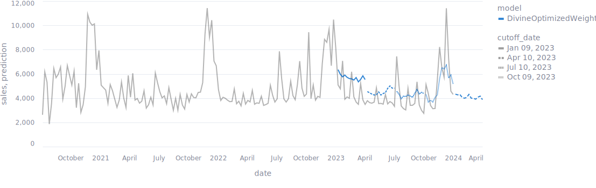
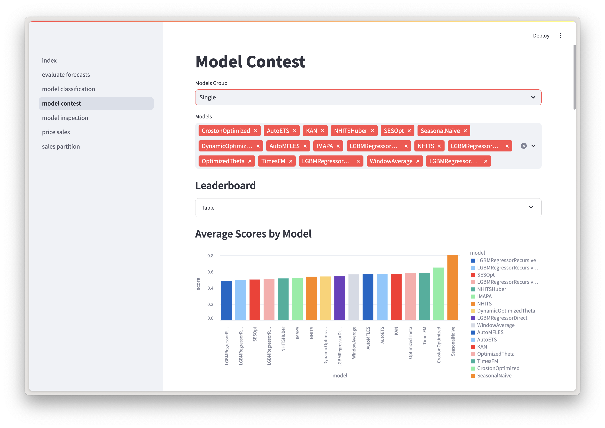

# VN1 Sales Forecast

> [!NOTE]
> This forecast placed fifth in the [VN1 Sales Forecasting Competition](https://www.datasource.ai/en/users/an-hoang/competitions/phase-2-vn1-forecasting-accuracy-challenge/datathon_detail/leaderboard).

This project focuses on creating accurate sales forecasts using a mixture of statistical, machine learning, and foundation models, integrated through an ensemble approach. The pipeline is built using Kedro.



## Getting Started

### 1. Install Dependencies

Ensure all required dependencies are installed. The depenedencies are defines in the `pyproject.toml` file.
If you use `rye` to manage your environment, you can install the dependencies by running:

```bash
rye sync
```

This will synchronize and install the dependencies as specified in the project's configuration file.

### 2. Prepare the Data

Place the raw data files in the `data/01_raw` directory. The expected files are:

- `Phase 0 - Price.csv`
- `Phase 0 - Sales.csv`
- `Phase 1 - Price.csv`
- `Phase 1 - Sales.csv`

Make sure these files are correctly named and formatted as they are essential for the pipeline to run successfully.

### 3. Run the Kedro Pipeline

If you use a M-Chip Macs you need to set the following environment variables. They are also specifies in in `.env`.

```bash
export KEDRO_DISABLE_TELEMETRY=1
export PYTORCH_ENABLE_MPS_FALLBACK=1
```

On the M-Chip Macs there is also a known issue with `lightgbm` multithreading.
This will manifest in an error when importing `lighgbm`.
You may need to reinstall a new version of `libomp` with

```bash
# Uninstall libomp if it was previous installed
brew uninstall -f libomp
wget https://raw.githubusercontent.com/Homebrew/homebrew-core/fb8323f2b170bd4ae97e1bac9bf3e2983af3fdb0/Formula/libomp.rb
brew install libomp.rb
rm libomp.rb
```

Execute the pipeline with the following command. Because the pipeline is quite large, it will take approximately 1 hour to complete.

```bash
kedro run
```

This will process the data and run all necessary transformations, model training, and evaluation steps.

### 5. Review the Results

The results, including forecasts, will be saved in the `data/09_submissions` directory. The final model output will be stored as `divineoptimizedweightsensemble.csv`.

## Modeling Approach

The final forecast, called the "Divine Optimized Weights Ensemble," is created through a combination of different modeling techniques. The ensemble combines statistical models, machine learning models, and foundation models to optimize performance according to the competition metric.

### Step 1: Candidate Models

A set of candidate models is trained on the data. These models include:

- `ZeroModel`
- `WindowAverage`
- `SeasonalNaive`
- `CrostonOptimized`
- `IMAPA`
- `AutoETS`
- `SimpleExponentialSmoothingOptimized`
- `OptimizedTheta`
- `DynamicOptimizedTheta`
- `AutoMFLES`
- `LightGBMRegressorRecursive`
- `LightGBMRegressorDirect`
- `TimesFM`

### 2. Optimal Weights Ensemble

The "Optimal Weights Ensemble" method combines predictions from multiple models by learning the optimal weights that minimize the competition metric. This approach ensures that the final forecast leverages the strengths of each individual model.

### 3. Divine Intervention

"Divine Intervention" involves manual adjustments to the forecast to enhance the competition metric further. It includes:

- **Time Series Classification**: Each time series is categorized into one of the following classes:
  - `train_zero`: Series where the last 12 months of sales are all zero. The forecast is set to zero.
  - `seasonal`: Series with a seasonal score greater than 0.5. The forecast uses the `SeasonalNaive` model.
  - `regular`: All other series. The forecast uses the "Optimal Weights Ensemble" model.

- **Manual Adjustments**: Specific series (identified by IDs) are manually adjusted to refine the forecasts and improve accuracy based on domain knowledge.

## Code Overview

The code follows uses the `kedro` framework to structure the project.
It uses several `kedro` pipelines to process data, train models, and generate forecasts.
A basic introduction to `kedro` can be found [here](https://docs.kedro.org/en/stable/tutorial/spaceflights_tutorial.html).
The code is structured into the following pipelines in `src/vn1_sales_forecast/pipelines` as follows:

- Preprocessing
  1. **data_wrangling**: Prepares and cleans the raw data for further processing.
  1. **tsfeatures**: Calculates time series features for both cross-validation and live forecasting.
  1. **classification**: Classifies time series based on their characteristics.
  1. **partition**: Partitions the data for more effective modeling.
- Model Training
  1. **model_stat**: Implements statistical models for forecasting.
  1. **model_ml_recursive**: Applies recursive machine learning models for forecasting.
  1. **model_ml_direct**: Implements direct machine learning models for forecasting.
  1. **model_ml_recursive_partitioned**: Uses partitioned data with recursive machine learning models.
  1. **model_nn**: Implements neural network models for forecasting.
  1. **model_timesfm**: Applies the TimesFM model for forecasting.
- Model Ensembling
  1. **ensemble_classification**: Creates an ensemble based on time series classification.
  1. **ensemble_fforma**: Implements the FFORMA (Feature-based Forecast Model Averaging) ensemble method.
  1. **ensemble_mixer**: Combines different models using a simple mixing approach.
  1. **ensemble_optimal_weights**: Creates an ensemble using optimal weights for different models.
  1. **ensemble_stacking**: Implements a stacking ensemble method.
  1. **divine_model**: Applies final adjustments and combines models based on specific rules.
- Evaluation
  1. **post_processing**: Handles post-processing tasks for the forecasts.
  1. **evaluation**: Evaluates the performance of different models and ensembles.
  1. **submission**: Prepares the final forecast for submission.

Each pipeline plays a crucial role in the overall forecasting process, from data preparation to model training, ensemble creation, and final forecast generation.

## Dashboard

A dashboard is available to visualize the forecasts and evaluate the model performance. To run the dashboard, execute the following command:

```bash
streamlit run app/index.py
```



## Pipeline Overview

The following diagram illustrates the Kedro pipeline used in the project.
You can also view the pipeline interactively by running:

```bash
kedro viz
```

This DAG shows the sequence of data processing, model training, and evaluation steps.


